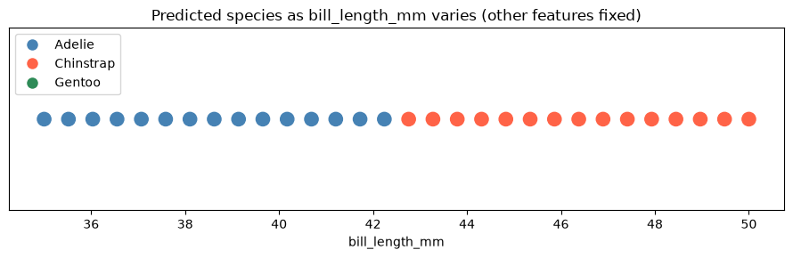
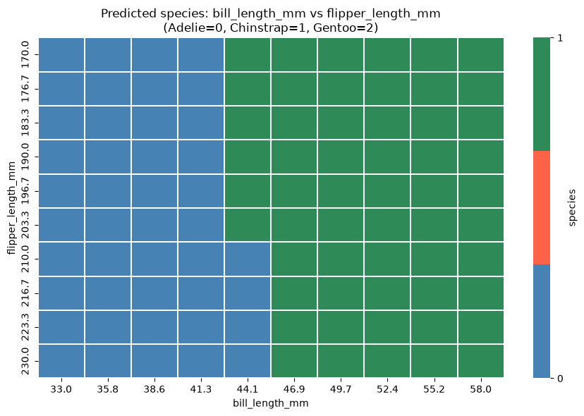

# Project Documentation

This site provides project documentation.
Use the documentation navigation to explore.

## How-To Guide

Many instructions are common to all our projects.

See
[⭐ **Workflow: Apply Example**](https://denisecase.github.io/pro-analytics-02/workflow-b-apply-example-project/)
to get the example projects running on your machine.

## Project Documentation Pages (docs/)

- **Home** - this documentation landing page
- [**Project Instructions**](./project-instructions.md)  - the standard project workflow
- [**Your Files**](./your-files.md) - how to copy the example and create your version
- [**Glossary**](./glossary.md) - project terms and concepts
- [**API**](./api.md) - autogenerated code documentation for the public project interface

## Phase 4. Technical Modification

For Phase 4, I copied `ml_07_case.ipynb` and renamed it `ml_07_sailors_p4.ipynb`.
I made 2 small changes to the `bill_length_mm` feature sweep:

- Increased the number of values tested from 20 to 30
- Narrowed the range from 30-60 mm to 35-50 mm

These changes were made to examine the model's decision boundary more closely.
The smaller range and additional test points made it easier to identify
where the prediction changed.

The model predicted Adelie up to a bill length of 42.24 mm and then changed to Chinstrap
at approximately 42.76 mm and remained Chinstrap for the rest of the tested range.

This was an easy modification because it only required changing values in `np.linspace`.

## Phase 5. Custom Project

For Phase 5, I copied `ml_07_sailors_p4.ipynb` and renamed it `ml_07_sailors_p5.ipynb`.
I kept the workflow while also testing `body_mass_g` and `flipper_length_mm`.
`body_mass_g` and `flipper_length_mm` feature sweeps did not change the prediction
from Adelie while the `bill_length_mm` feature sweep had the strongest influence for
the Adelie baseline. This showed that the model was more sensitive to bill length when
other features were held constant.

### Basis and API

I used the deployed ML Penguin predictor, which predicts the penguin species `Adelie`,
`Chinstrap`, and `Gentoo`. The API expects `bill_length_mm`, `bill_depth_mm`, `flipper_length_mm`,
and `body_mass_g` as inputs. I decided to keep the original API to investigate the behavior of
the existing deployed model rather than train a new one.

### Investigation Approach

In addition to the original `bill_length_mm` sweep, I added custom sweeps for `body_mass_g` and
`flipper_length_mm`. I also used the prediction grid and edge cases to see how the model
responds to different combinations or unrealistic values.

### Findings: Feature Sensitivity

`bill_length_mm` had the clearest influence on the model's predictions. The prediction first
shifted away from Adelie at approximately **42.76 mm**. The prediction stayed Chinstrap for the
remainder of the range. I was surprised to see that changing `body_mass_g` from 2500-6000 grams
and `flipper_length_mm` from 170-230 mm did not change the prediction when other Adelie
baseline features were held constant. Since those sweeps continued to predict Adelie, it
suggests that bill length had a stronger individual influence for this baseline.

### Findings: Edge Cases

I tested a missing feature, extremely small and large bill lengths, a negative bill length,
and a zero body mass. The API was still able to produce predictions for these unrealistic
measurements. This shows that additional input validation would help make the API more
robust. This could prevent impossible measurements from being accepted.

### Summary

This project showed that the model is more sensitive to some features than others. Bill
length produced a clear decision boundary, while body mass and flipper length alone did not
change the prediction from the Adelie baseline. I would improve the API by adding validation
for impossible or unrealistic values such as negative measurements or zero body mass. This
type of investigation could be applied to real-world models to identify important features and
test decision boundaries.
